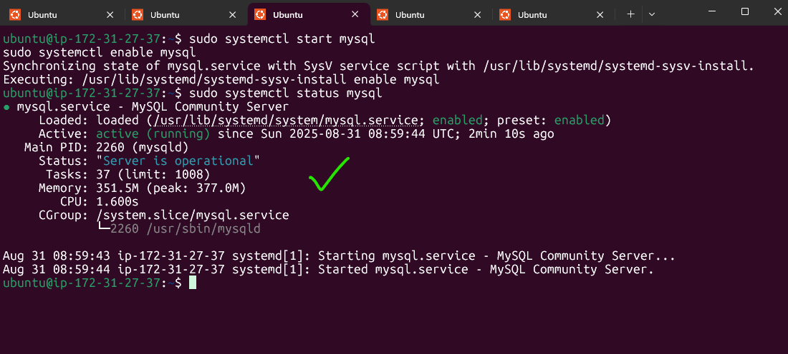
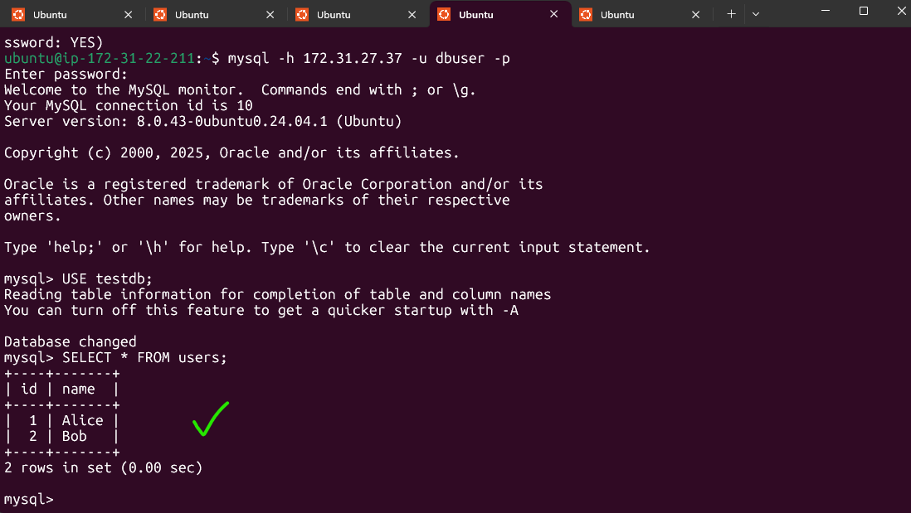

---

# Client–Server Architecture with MySQL on AWS EC2

## 📖 Overview

This project demonstrates how to set up a simple **client–server architecture** using **MySQL** on Amazon EC2 instances.

* The **server node** hosts a MySQL database.
* The **client node** connects remotely to the server to run queries.

This architecture simulates a real-world distributed system, where application logic and database services run on different machines.

---

## 🏗️ Architecture

* **Server EC2 Instance** → MySQL Server installed and configured for remote access.
* **Client EC2 Instance** → MySQL client installed to communicate with the server.
* **AWS Security Groups** → Manage access to MySQL (port 3306) and SSH (port 22).

```
              +-------------------+
              |   AWS VPC/Subnet  |
              |                   |
   +----------+----------+   +----+-----------+
   |  Client EC2         |   |  Server EC2    |
   |  (MySQL Client)     |   |  (MySQL Server)|
   |                     |   |                |
   | mysql -h <serverIP> |   | Port 3306 open |
   +----------+----------+   +--------+-------+
              |                       |
              +--------- Port 3306 ----+
```

---

## 🚀 Prerequisites

* An active **AWS account**.
* At least **two EC2 instances** (Ubuntu/Debian/RedHat).
* Security group rules:

  * **Port 22** → SSH access.
  * **Port 3306** → MySQL access from the client’s IP.

---

## ⚙️ Step 1: Launch EC2 Instances

1. Sign in to the **AWS Management Console**.
2. Launch **two EC2 instances**:

   * One will act as the **MySQL Server**.
   * The other as the **MySQL Client**.
3. Attach both instances to the **same VPC/subnet** for easier communication.
4. In the **server’s security group**, allow inbound traffic on **port 3306** from the client’s IP address.

---

## ⚙️ Step 2: Install MySQL on the Server

SSH into the **server instance** and install MySQL:

```bash
sudo apt update -y
sudo apt install mysql-server -y
```

Enable and start the service:

```bash
sudo systemctl start mysql
sudo systemctl enable mysql
```



---

## ⚙️ Step 3: Configure MySQL for Remote Access

1. Log in to MySQL:

   ```bash
   sudo mysql -u root -p
   ```

2. Create a new user and grant remote access:

   ```sql
   CREATE USER 'dbuser'@'%' IDENTIFIED BY 'password';
   GRANT ALL PRIVILEGES ON *.* TO 'dbuser'@'%' WITH GRANT OPTION;
   FLUSH PRIVILEGES;
   ```

3. Update MySQL configuration to listen on all interfaces:

   ```bash
   sudo nano /etc/mysql/mysql.conf.d/mysqld.cnf
   ```

   Change:

   ```
   bind-address = 127.0.0.1
   ```

   To:

   ```
   bind-address = 0.0.0.0
   ```

4. Restart MySQL:

   ```bash
   sudo systemctl restart mysql
   ```

---

## ⚙️ Step 4: Install MySQL Client on the Client Instance

SSH into the **client instance** and install the MySQL client:

```bash
sudo apt update -y
sudo apt install mysql-client -y
```

---

## ⚙️ Step 5: Connect Client to Server

From the **client instance**, connect to the server using:

```bash
mysql -h <SERVER_PRIVATE_IP> -u dbuser -p
```

👉 If using **public IPs**, make sure the server’s security group allows inbound connections from the client’s public IP on **port 3306**.

---

## 📊 Testing the Setup

On the **server**:

```sql
CREATE DATABASE testdb;
USE testdb;
CREATE TABLE users (id INT AUTO_INCREMENT PRIMARY KEY, name VARCHAR(100));
INSERT INTO users (name) VALUES ('Alice'), ('Bob');
```

On the **client**:

```sql
USE testdb;
SELECT * FROM users;
```
Expected Output:



---

## ✅ Conclusion

You now have a functioning **client–server architecture** with **MySQL on AWS EC2**.
This setup demonstrates how distributed systems can separate application logic (client) from data storage (server), similar to production-ready environments.

---
